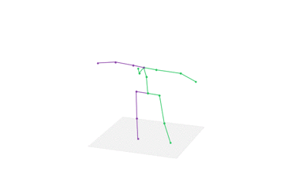
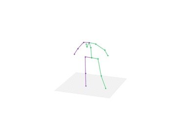

# OpenPose + 3dPoseBaseline + Unity3d

## Display

### online display video

 

### offline display video

 

### online 3d display video

 

### offline 3d display video

 

## Introduction

在Ubuntu 16.04下（使用笔记本电脑的单个摄像头）基于[OpenPose]([https://github.com/CMU-Perceptual-Computing-Lab/openpose)和[3dPoseBaseline](https://github.com/una-dinosauria/3d-pose-baseline)来实时捕获人体关节点并将其转化为三维空间坐标，最后通过[Unity3d](https://unity3d.com/)来控制模型的动作。我的Baseline基于[n1ckfg-OpenPoseRig](https://github.com/n1ckfg/OpenPoseRig)，使用的机器是GTX 1060的笔记本电脑，实时检测的速度可以达到每秒10帧左右。这只是一个简易版本，原因在于我的程序存在下面两个问题

- 当OpenPose检测的人体关节点不全时，将输入反馈到3dPoseBaseline中会导致三维关节点的转化出错
- Unity三维人体模型的关节点移动依旧存在一些问题（关于这个问题，我会考虑请教U3D方向的大佬）

如果时间和精力充足，我会修复这两个问题，并考虑进一步优化整个过程。这里先把自己参考和学习的链接都放上来（剩下的都是自己走的弯路，没有太多参考价值）。

## Experiment

### joint point

[OpenPose虽然具备检测三维关节点的功能](https://github.com/CMU-Perceptual-Computing-Lab/openpose/blob/master/doc/modules/3d_reconstruction_module.md)，但是它需要多个摄像头才可以实现（而且维护人员好像对这个功能并不重视）。当然也有[使用OpenPose二维关节点来控制Unity的开源程序](https://github.com/CMU-Perceptual-Computing-Lab/openpose/pull/975)，然而遗憾的是，在阅读源码之后，我发觉这个程序对我的帮助微乎其微。因此需要重新考虑使用其他方式来进行三维关节点坐标的获取，比如3dPoseBaseline。虽然[ArashHosseini](https://github.com/ArashHosseini)已经[对3dPoseBaseline进行改进来转化OpenPose的关节点](https://github.com/ArashHosseini/3d-pose-baseline)，但程序是基于COCO模型的，[这个模型的检测速度很慢且OpenPose官方说后期会移除该模型](https://github.com/CMU-Perceptual-Computing-Lab/openpose/blob/0fd438d8f2160bef39386d75c69e390913829736/doc/faq.md#difference-between-body_25-vs-coco-vs-mpi)。此外ArashHosseini的程序存在两个主要的不足

- 没有很好的处理某一帧检测出错，即该帧没有检测到任何关节点的情况
- 离线处理所有帧的效果确实非常好，但在线处理没有使用平滑且实时读取关节点JSON存在一些问题

### unity3d

在与Unity模型进行交互的过程中，我认识到将真实世界坐标应用到Unity空间确实有难度。本以为只是简单的矩阵变换，但是我低估了这个过程的难度（也高估了自己在一年前对Unity的熟悉度）。阅读Kinect源码、查找相关博文......经过将近一星期的摸索，我也没有实现很理想的变换及应用方式（这也与自己的时间分配有关）。在一个很偶然的机会下，我发现了三位日本老哥的博文：[博客1](https://qiita.com/keel)，[博客2](https://qiita.com/romaroma)，[博客3](https://qiita.com/fuloru169)。感谢他们的博文，让我初步实现了这一功能（虽然展示效果依旧不是很理想）。这里我使用的核心Unity项目基于[OpenPose-Rig](https://github.com/keel-210/OpenPose-Rig)。

### data transmission

可以考虑使用计算机网络的知识来完成该过程，具体参考[网络传输](https://github.com/CMU-Perceptual-Computing-Lab/openpose/pull/975)，不过该方法不太稳定。这里建议使用本地数据传输。需要注意的是：文件的读和写不可以同时进行，这里需要做一些特殊处理。

### result

最后我使用BODY_25模型来代替ArashHosseini程序中的COCO模型并修复该程序中的两个问题，最后对整个流程进行简化和整合。只需要运行一个简单的shell脚本，就可以完成实时检测关节点控制Unity的模型的功能，既可以自主选择交互的时间，也可以通过按下"Enter"键来退出程序并kill后台进程。[基于OpenPose官方源程序](https://github.com/CMU-Perceptual-Computing-Lab/openpose/blob/8e4cd8052f1edbbe04f4405592d8da310f3db0a3/doc/demo_overview.md#main-flags)，我禁用了UI和Render，这也在一定程度上提升了实时检测的速度。

## Reference

https://github.com/CMU-Perceptual-Computing-Lab/openpose

https://github.com/n1ckfg/OpenPoseRig

https://github.com/keel-210/OpenPose-Rig

https://github.com/miu200521358/3d-pose-baseline-vmd

https://github.com/ArashHosseini/3d-pose-baseline

https://github.com/una-dinosauria/3d-pose-baseline

https://github.com/unity3d-jp/unitychan-crs

http://unity-chan.com/contents/guideline/

https://qiita.com/keel

https://qiita.com/romaroma

https://qiita.com/fuloru169

http://www.manew.com/thread-22128-1-1.html

https://pterneas.com/2014/05/06/understanding-kinect-coordinate-mapping/